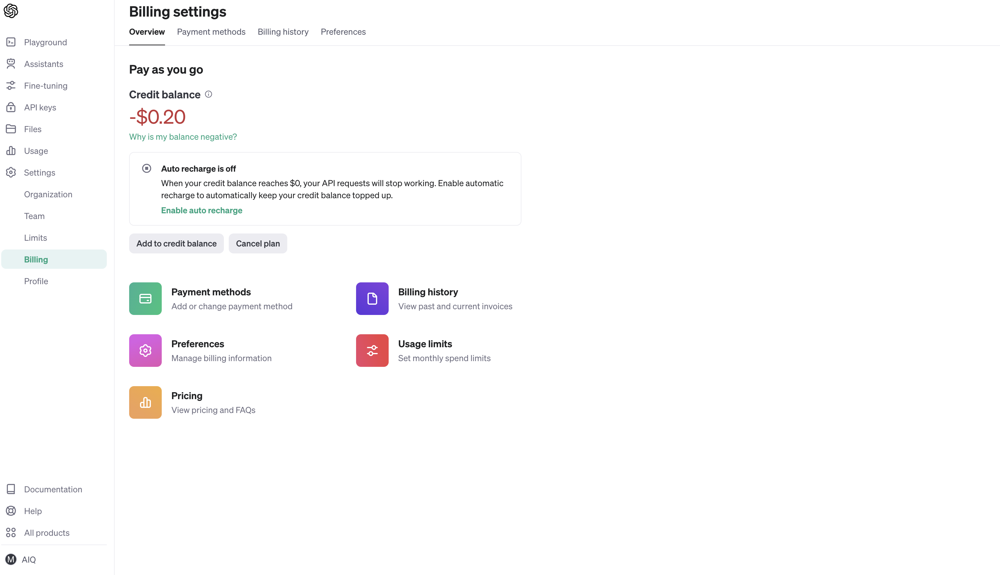
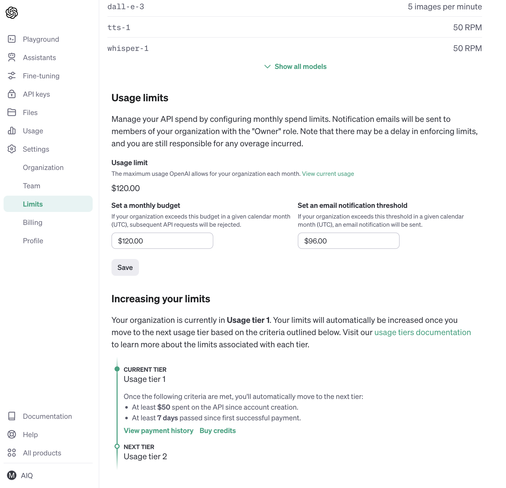

# Industry Judgement App BackEnd API

## App 概要

- 会社名と電話番号から、業種を判定するツールの BackEnd-API

- Flask-API と Selenium の 2 つの Container を動かします。

## 環境構築方法(初期 setup)

<br>

### 0. DockerNetwork を作成する

[F-E] と [B-E]の Docker Compose 間で、通信するための共通の Network を作成しておきます。  
`docker network create` コマンドで、独自の Network を作成することができます。

```bash
docker network create industry_judgement_app_network
```

`docker network ls` コマンドで、Docker Network の一覧を確認することができます。

```bash
docker network ls
```

### 1. プロジェクトを Clone

```bash
git clone git@github.com:yukimura-manase/industryJudgement-backend-api.git
```

## 2. 環境によって、docker-compose.yml の使用イメージを変える

- 注意事項、M1 Mac など ARM で動作する環境かどうかで、使用するイメージが変わります。

- ARM 対応の Selenium Docker Image を使わないと M1 Mac などでは動きません。

  - 詳細は、[system spec が通らなくなった問題を SeleniARM で解決！](https://zenn.dev/lovegraph/articles/26109f0bc2f4c5)をご参照ください。

  - ちなみに、ARM 対応の Image 名は、docker-selenium ではなく、 docker-seleniarm になっている。。。芸が細かい。。。

- 環境に応じて、`docker-compose.yml`の`selenium`のコメントアウト箇所の編集をお願いします。

### 3. docker-compose で Dockerfile から image をビルドする

プロジェクトルートに移動します。

```bash
cd industryJudgement-backend-api
```

続いて、Dockerfile から Docker Image を作成します。  
docker-compose build コマンドは、Dockerfile から image を作成してくれるコマンドです。

```bash
docker-compose build
```

このコマンドを実行すると、Dockerfile に従って各サービスの Docker イメージがビルドされ、
<br/>
イメージ名とタグ名が作成されます。

### 4. Docker Image の ビルドを確認する

docker image ls で、build された image を確認しておきます。

```bash
docker image ls
```

### 5. docker-compose で Docker コンテナを実行する

次のコマンドで、Docker Compose ファイルに定義されたサービスをバックグラウンドで起動できます。

```bash
docker-compose up -d
```

Docker Image の Build と Container の実行を同時に実施する場合は、次のコマンドです。

```bash
docker-compose up --build
```

### 6. docker-compose で コンテナの起動状況を確認する

Docker コンテナの起動状況は、`docker container ps` コマンドで確認できます。

```bash
docker container ps
```

### 7. Web ブラウザからアクセスする

http://localhost:5001/api/ にアクセスして、BackEnd-API の起動を確認します。

### 8. Docker コンテナの停止 & 削除

docker-compose down コマンドを使用して、すべてのコンテナを停止し、削除することができます。

```bash
docker-compose down
```

## トラブルシューティング

- よくある Error パターンの対応方法(トラブルシューティング)をまとめています。

### 1. openai.RateLimitError: Error code: 429 エラー

##### 対応方法

- OpenAI の API 制限 によるエラー

- 次の記事を参考に、Rate limits を Update していきます。

  - [OpenAI API のエラー(openai.error.RateLimitError)について](https://qiita.com/kotattsu3/items/d6533adc785ee8509e2c)

1. [Billing Settings](https://platform.openai.com/account/billing/overview) ページ



2. [Limits](https://platform.openai.com/account/limits) ページ

   - Usage limits を設定できる



##### エラー内容

```bash
flask_api  | openai.RateLimitError: Error code: 429 - {'error': {'message': 'You exceeded your current quota, please check your plan and billing details. For more information on this error, read the docs: https://platform.openai.com/docs/guides/error-codes/api-errors.', 'type': 'insufficient_quota', 'param': None, 'code': 'insufficient_quota'}}
```

### 2. Driver info: driver.version: unknown エラー

##### 対応方法

1. M1 Mac の場合は、Docker Image の選択による Error の可能性あり。

   - `docker-compose.yml`で選択する Docker Image は `seleniarm/standalone-chromium`の方になります。

2. Docker のメモリ不足によって、 Error が起こる可能性もあるので、[こちらの記事](https://zenn.dev/aiq_dev/articles/931a8f58f80359)を参考にメモリを解放してください。

   - `docker system df`: Docker System で使用しているメモリ状況の確認コマンド

   - `docker system prune --volumes`: 使用されていない Docker Image, Container, Volume, Network の一括削除コマンド

##### エラー内容

```bash
selenium.common.exceptions.SessionNotCreatedException: Message: Could not start a new session. Error while creating session with the driver service. Stopping driver service: Could not start a new session. Response code 500. Message: unknown error: cannot create temp dir for user data dir
flask_api  | Host info: host: 'db9eaa4e969a', ip: '172.20.0.3'
flask_api  | Build info: version: '4.16.1', revision: '9b4c83354e'
flask_api  | System info: os.name: 'Linux', os.arch: 'aarch64', os.version: '6.4.16-linuxkit', java.version: '11.0.21'
flask_api  | Driver info: driver.version: unknown
flask_api  | Build info: version: '4.16.1', revision: '9b4c83354e'
flask_api  | System info: os.name: 'Linux', os.arch: 'aarch64', os.version: '6.4.16-linuxkit', java.version: '11.0.21'
flask_api  | Driver info: driver.version: unknown
flask_api  | Stacktrace:
flask_api  |     at org.openqa.selenium.grid.node.config.DriverServiceSessionFactory.apply (DriverServiceSessionFactory.java:225)
flask_api  |     at org.openqa.selenium.grid.node.config.DriverServiceSessionFactory.apply (DriverServiceSessionFactory.java:72)
flask_api  |     at org.openqa.selenium.grid.node.local.SessionSlot.apply (SessionSlot.java:147)
flask_api  |     at org.openqa.selenium.grid.node.local.LocalNode.newSession (LocalNode.java:464)
flask_api  |     at org.openqa.selenium.grid.distributor.local.LocalDistributor.startSession (LocalDistributor.java:645)
flask_api  |     at org.openqa.selenium.grid.distributor.local.LocalDistributor.newSession (LocalDistributor.java:564)
flask_api  |     at org.openqa.selenium.grid.distributor.local.LocalDistributor$NewSessionRunnable.handleNewSessionRequest (LocalDistributor.java:824)
flask_api  |     at org.openqa.selenium.grid.distributor.local.LocalDistributor$NewSessionRunnable.lambda$run$1 (LocalDistributor.java:784)
flask_api  |     at java.util.concurrent.ThreadPoolExecutor.runWorker (None:-1)
flask_api  |     at java.util.concurrent.ThreadPoolExecutor$Worker.run (None:-1)
flask_api  |     at java.lang.Thread.run (None:-1)
```

## 参考・引用

1. [Python Selenium について](https://zenn.dev/manase/scraps/28fe7b34824e79)

2. [system spec が通らなくなった問題を SeleniARM で解決！](https://zenn.dev/lovegraph/articles/26109f0bc2f4c5)

3. [Docker で、Error load build context no space left on device というエラーの解決方法](https://zenn.dev/aiq_dev/articles/931a8f58f80359)

4. [OpenAI API のエラー(openai.error.RateLimitError)について](https://qiita.com/kotattsu3/items/d6533adc785ee8509e2c)
